# MyVectorNet
 基于TNT-Trajectory-Prediction修改的VectorNet，代码中有详细的注释，部分模块由于考虑到后续TNT的需要，会有一些VectorNet用不上的数据

运行环境：cuda为11.7

torch_geometric建议去官网下载使用whl手动安装而不是使用pip或者conda安装，不能使用torch_geometric 2.0以上的版本，因为代码发生了变化

python==3.8.0

matplotlib==3.7.1

numpy==1.23.5

pytorch==2.0.0

tqdm==4.65.0

torch_geometric==1.7.2

torch_cluster==1.6.1

torch_sparse==0.6.17

torch_scatter=2.1.1+pt20cu117

torch_spline_conv==1.2.2+pt20cu117

# 使用

先把Argoverse数据集的train, test, val的csv文件放入工程目录的data/raw_data文件夹下面，目录结构如下：

* MyVectorNet
  * data
    * interm_data
      * ...
    * raw_data
      * test
      * train
      * val

运行utils/ArgoversePreprocessor.py处理数据集生成interm_data

运行train.py进行训练

运行test_vectornet.py进行测试，下面是在部分Argoverse数据集训练（只用了30000左右的序列），在val上输出的结果，在val的minADE为2.56：在第一个图可以看到地图信息如车道线对轨迹预测的影响

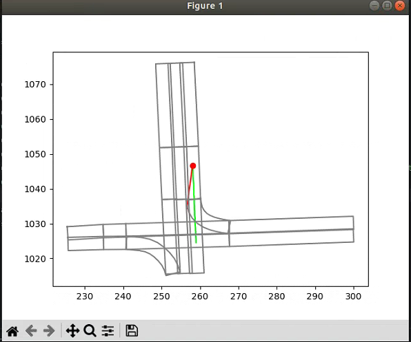

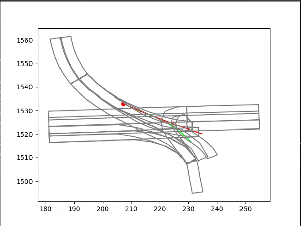

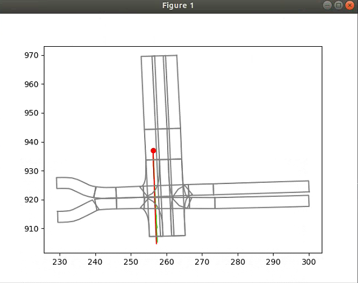

# 模块介绍
程序结构：

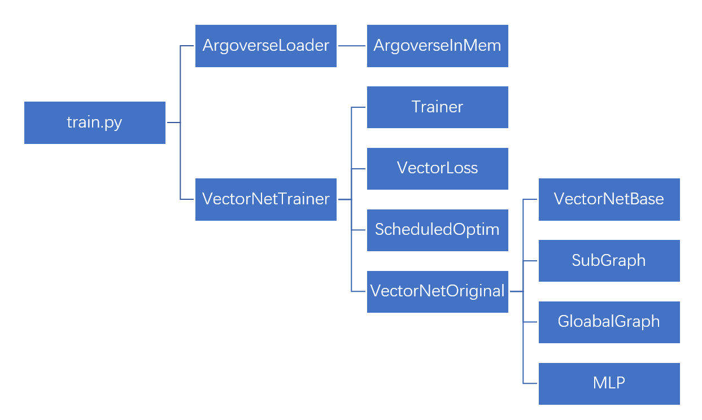

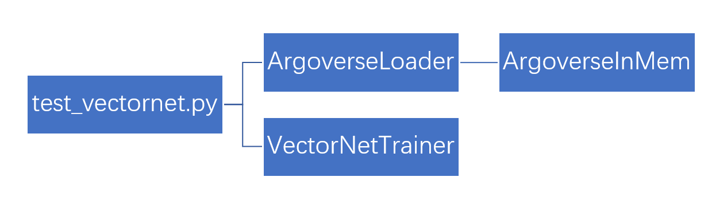

## train.py

训练VectorNet的主程序

### ArgoverseLoader

数据加载器，使用的是InmemoryDataset，所以需要较大的内存

## VectorNetTrainer

### Trainer

VectorNetTrainer的基类，包含了保存模型，加载模型，计算误差的方法

### VectorLoss

loss函数类

### SubGraph

构造向量子图类

### GlobalGraph

构造全局图类

### MLP

基本的MLP类

## test_vectornet.py

测试训练好的VectorNet

# VectorNet论文解析

# Introduction

提出了一种结合矢量地图的轨迹预测方法，使用多层图神经网络GNN来建模轨迹与地图向量之间的关系

# VectorNet approach

## 3.1

论文中**向量的表示方法为**

[起始点，终止点，其他特征，所属车道id]

并将所有向量坐标**基于历史轨迹序列的最后一个点进行归一化**

未来工作：所有交互agent共享坐标系以使得能够并行预测

## 3.2

**构造向量子图**

论文中子图使用的是全连接图，只需要用MLP做即可，实际上用不上edge_index

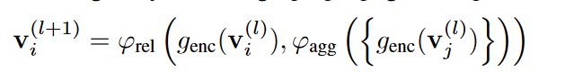

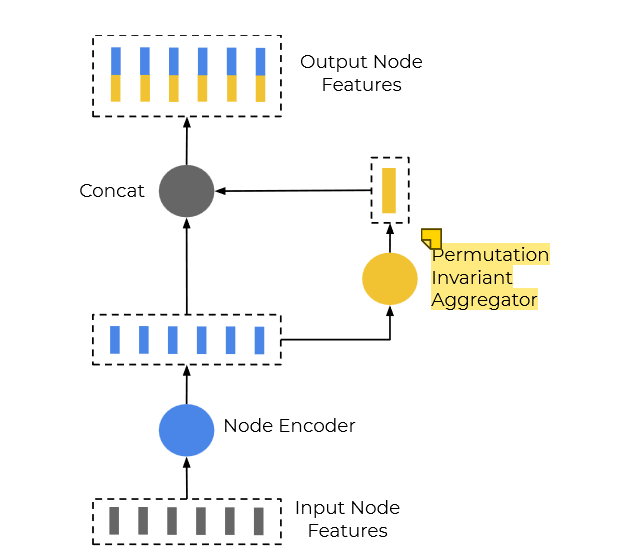

输入的特征（每一个灰色的条代表这个polyline的点）经过一个Encoder（论文中使用的是hidden size是64的MLP):

$$g_{enc}()$$

之后得到若干64维向量（蓝色），这些向量经过aggregator（一个GNN的max_pooling操作）

$$\varphi_{agg}()$$

注意这里**max_pooling在torch_geometric中可以用cluster操作**，cluster是根据同一lane_id（车道）/polyline_id（轨迹）的向量节点来进行（每一个向量都由多个节点组成）

max_pooling之后又得到一个新的黄色向量，代表着子图节点内部的交互信息以及特征，然后再与原来的蓝色向量concat:

$$\varphi_{rel}()$$

就得到了一层子图最后输出的特征向量。

concat之后，output node features的维度是128，再给到下一层subgraph，第一层的MLP input是64，但第二层开始的subgraph输入维度是128

这里使用了**三层subgraph**，每一层之间都使用layer norm和relu，三层subgraph之间的权重不共享

最后，再对最后一层subgraph输出的output node features使用一个max_pooling，就是下面的函数，获得整体的polyline level features，也就是**子图节点Node，给全局图使用**

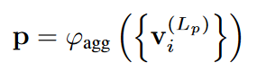

## 3.3

**全局图以及高层信息交互**

**所有MLP的大小都是64**

简单起见，论文使用的GNN是一个全连接图

**全局图的输入是subgraph的输出p再拼上邻接矩阵A，所以输入维度是subgraph的输出维度+（邻接矩阵的维度），论文的全局图是全连接图，所以可以不输入邻接矩阵**

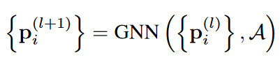

全局图使用self-attention，用于建模各个子图节点之间的关系，只用了单层GNN

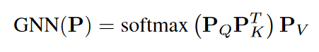

论文**最后经过一个output size为60的MLP作为decoder来预测x,y的值**

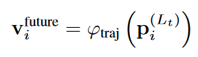

论文还使用了auxiliary图来辅助训练，就是随机mask掉某一个polyline nodes，然后再进行训练

为了标识这个被mask掉的节点，选用了该节点中的所有向量的最小坐标起点作为identifier

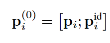

如果使用了aux层，**全局图的输入需要加上一个identifier(维度为2)**，最后全局图输出的结果中，需要单独计算被mask部分的loss（具体参考程序），aux的计算方法是aux_in（全局图中被mask的节点的输出值）过一个MLP得到

aux_out，而aux_out和aux_real之间使用huber loss

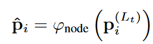

## 3.4

损失函数

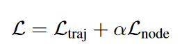

L_traj一般都用MSE，后面的alpha取1，L_node是huber loss，程序中用了smooth_l1_loss（就是Huber loss），如果不使用aux训练，则只需要L_traj

论文在polyline node features输入全局图前，进行了L2 normalize

**预测目标的是下一步x, y的增量**而不是下一时刻的坐标值

有了历史轨迹最后时刻的坐标值以及后30步的x，y增量，就可以形成预测轨迹

